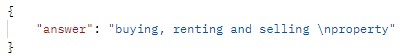

# Chatbot Service using LangChain, FastAPI and PostgreSQL pgveector

This project is a very simple chatbot service, it's meant to recieve api request to upload files and questions to answer based on the files content. The results aren't too good, but they aren't wrong or too bad. But you can improve it but using other LLM and embedding systems like Llama or online service like OpenAI.


## Quick Start

**- Install PostgreSQL (v16):**
You'll need to use PostgreSQL version 16, at least in my case and at the time of writing this, pgvector is not compatible with PostgreSQL v17.

**- Install PostgreSQL (v16):**
And you'll need to install pgvector, you can do so by following the instructions in this link:
https://github.com/pgvector/pgvector

**- Set up your database**
Create a database, and run the code in database.sql

**- Set up your configuration file**
Create .env file and put the variables that you'll use for database connection
```
DB_NAME="Database_Name"
DB_USER_NAME="username"
DB_PASSWORD="password"
HOST="localhost"
```

**- Install dependencies** 
Run
```
pip install -r requirements.txt
```

**- Start the server**
* Run
```
uvicorn main:app --reload
```

## Exemples
In my case I used a Monopoly game file, you can find it in the public folder of the repo. And here below is some screenshots of the api responses for uploading and asking couple of questions. !! Again they are not good, but they aren't technically wrong, more like a deplomatic answer.

-------------


-------------


-------------


-------------